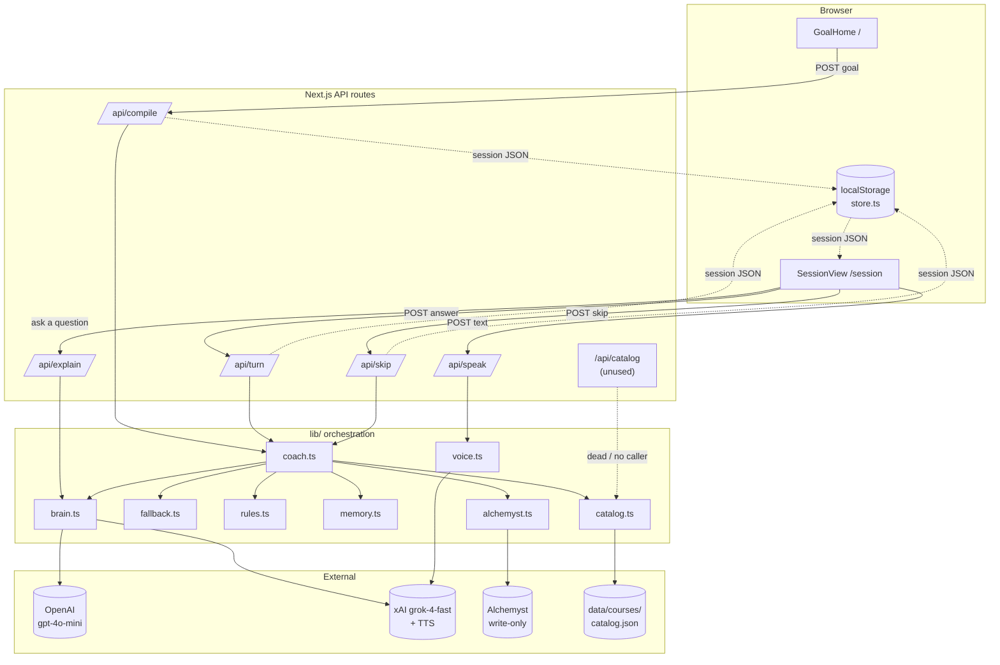
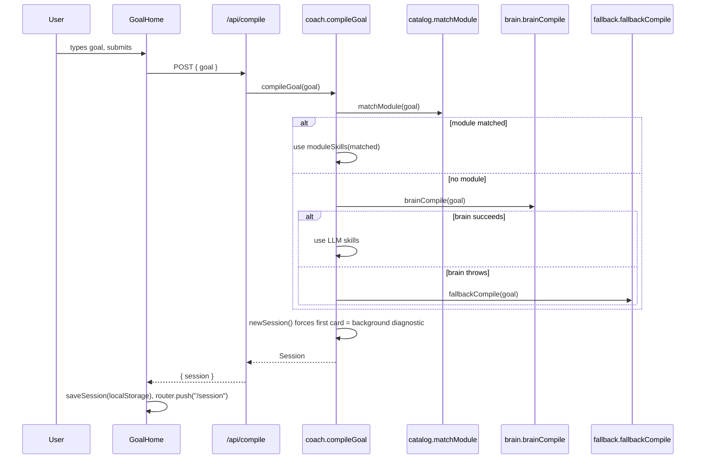
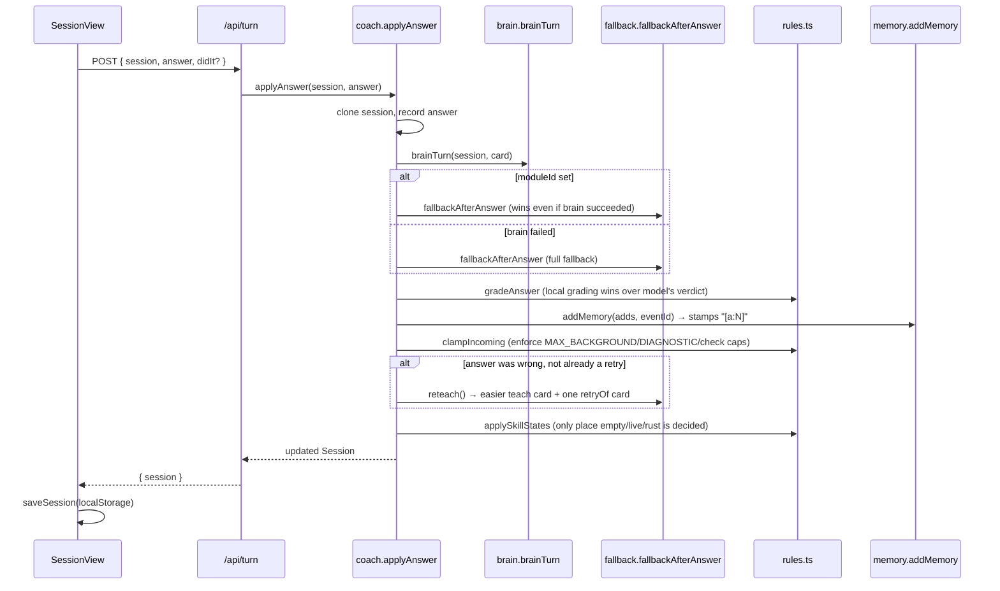

# Codebase Map — STAND

> Auto-generated by Cartographer. Last mapped: 2026-08-30.

STAND is a hackathon app (Calcutta AI Club, Problem 4 — "The Coach"). A typed goal
compiles into a live one-card-at-a-time coaching session, with cited memory and
optional voice. No users, no login, no server-side database — the browser holds
the session, the server is stateless per request.

## System Overview



**Key architectural fact:** there is no server-side session store. The client
posts the entire `Session` object on every `/api/turn` and `/api/skip` call; the
server clones it, mutates it, and returns it. The client then re-saves it to
`localStorage`. See [Gotchas](#gotchas).

## Directory Structure

```
.
├── data/
│   ├── courses/catalog.json        # 3 hand-authored college modules (psych x2, cs-intro)
│   └── khan-academy/*.md           # research-only, not read by any code
├── scripts/
│   └── ingest-courses.mjs          # fetches MIT/Yale/OpenStax pages -> sources-snapshot.json
├── src/
│   ├── app/
│   │   ├── page.tsx                # "/"        -> GoalHome
│   │   ├── session/page.tsx        # "/session" -> SessionView
│   │   ├── layout.tsx, globals.css # fonts + "coaching file" paper theme
│   │   └── api/
│   │       ├── compile/route.ts    # goal -> new Session
│   │       ├── turn/route.ts       # answer -> graded Session (also handles override)
│   │       ├── skip/route.ts       # "it's next week" -> refresher card
│   │       ├── speak/route.ts      # text -> TTS audio + word cues
│   │       ├── explain/route.ts    # inline "explain this" Q&A, brain-only, no fallback
│   │       └── catalog/route.ts    # GET module list — built, unused by any UI
│   ├── components/
│   │   ├── GoalHome.tsx            # blank goal box, 3 placeholder chips
│   │   ├── SessionView.tsx         # orchestrator: fetch, audio playback, layout
│   │   ├── CardView.tsx            # the one visible card (all kinds)
│   │   ├── SkillsRail.tsx          # right-hand "Your skills" 6 slots
│   │   ├── ReceiptsDrawer.tsx      # cited memory + raw session JSON
│   │   ├── ExplainChat.tsx         # inline mini Q&A under a teach card
│   │   └── Transcript.tsx          # karaoke word highlighter
│   └── lib/
│       ├── schema.ts               # the central types (Session, Card, Memory, ...)
│       ├── coach.ts                # orchestrator: brain -> catalog override -> fallback
│       ├── brain.ts                # OpenAI/xAI chat calls, JSON-mode, defensive parsing
│       ├── fallback.ts             # hardcoded curriculum for 4 rehearsed goals + generic
│       ├── rules.ts                # pure rules: caps, grading, skill state, clamping
│       ├── session.ts              # Session/Event primitives, forced first card
│       ├── memory.ts               # "[a:N]" citation stamping
│       ├── catalog.ts              # keyword match + card builders over catalog.json
│       ├── voice.ts                # xAI TTS fetch, null-or-throw
│       ├── cues.ts                 # word-timing: real char-times or estimated
│       ├── alchemyst.ts            # write-only POST of memory pages, best-effort
│       └── store.ts                # localStorage wrapper (the only persistence)
├── UX-LOCK.md                      # the decisions actually implemented (source of truth)
├── ONE-PAGER.md                    # the original pitch spec (partly aspirational, see below)
├── LATER.md                        # explicitly deferred (MiniMax video) — not started
└── README.md                       # quickstart + architecture one-liner
```

## Module Guide

### `lib/schema.ts` — the central contract

**Purpose**: Every type the app passes between client, API routes, and lib
functions. No runtime validation library (no zod) — this is compile-time only.

```ts
type Path = "college" | "life"
type SkillState = "empty" | "live" | "rust"
type CardPhase = "diagnostic" | "training" | "teach" | "check" | "refresher"

Skill  = { id, label, state: SkillState, evidence: string[] }   // evidence = ["[a:3]", ...]
Step   = { title, body, speak }                                  // life how-to steps
Source = { id, title, url, attribution, license? }
ContentBlock = { id, kind, heading?, body, sourceId? }            // college teach blocks
WordCue = { text, start, end }                                   // TTS karaoke timing

Card = {
  id, kind, prompt, skillId?,
  choices?, steps?, blocks?, script?, sources?, minutes?, moduleId?,
  subjective?, rubric?, answer?, correct?, retryOf?, phase?, didIt?,
  expected?, answerEventId?, feedback?
}

Memory  = { stand: string[], landed: string[], promised: string[] }  // the 3 cited pages
Session = {
  id, version, goal, path, skills: Skill[], cards: Card[], events: Event[],
  memory: Memory, brain?, receipts?: { alchemyst?, note? }, moduleId?, moduleTitle?
}
```

**How this maps to the ONE-PAGER spec** (`person / stand / landed / promised / plan / session`):
- `stand` / `landed` / `promised` — **implemented as spec'd**, each line ends in
  a real `[a:N]` citation (`memory.ts::stampLine`).
- `person: {name, role, goal}` — **not implemented**; only `session.goal` exists.
- `plan: [{n, title, why_this_next}]` — **not implemented**; a flat `cards[]`
  array replaces a visible 5-session plan (matches ONE-PAGER's own "idea 3: one
  next step, not a catalog," just without the plan object).
- `session.teach` "example from their job" — **cut on purpose**: UX-LOCK
  explicitly overrides the ONE-PAGER's invoice/job-example idea ("No invoices.
  No company examples. Goals are general.").
- `session.probe` work-sample rows — **cut on purpose**, same UX-LOCK override.
- `stand.level: 0-3` mastery ladder (from the Khan Academy research doc) —
  **not implemented**; `SkillState` is only 3 states (`empty/live/rust`).

### `lib/coach.ts` — the orchestrator

**Purpose**: The one place that decides what actually goes into the next
`Session`. Everything else is a service it calls.

**Exports**: `compileGoal(goal)`, `applyAnswer(session, answer, {didIt})`,
`applySkip(session)`, `applyOverride(session, path)`.

**The layering, in priority order** (this is the demo-robustness design):
1. Try the brain (`brain.ts`) inside a try/catch.
2. If the session already matched a catalog module (`moduleId` set), the
   catalog-sourced cards from `fallback.fallbackAfterAnswer` **override** the
   brain's cards even when the brain succeeded — the model is not trusted to
   know the sourced-course content.
3. If the brain call throws, fall back entirely to `fallback.ts`.
4. If after all that `nextCards` is still empty (and the card isn't a
   refresher), fallback runs again as a last resort.
5. `rules.clampIncoming` enforces the UX-LOCK caps regardless of source.

### `lib/brain.ts` — the LLM integration

**Exports**: `brainCompile`, `brainTurn`, `brainSkip`, `brainExplain`,
`brainConfigured` (dead — never called).

**Client selection** (`openaiClient()`): `OPENAI_API_KEY` first
(`gpt-4o-mini`), else `XAI_API_KEY` via `baseURL: "https://api.x.ai/v1"`
(`grok-4-fast`) as an OpenAI-compatible client, else `null` and callers throw.

**Gotcha — contradicts the README**: `XAI_API_KEY` is dual-purpose. README
says "ChatGPT is the brain, Grok is the voice," but in code `XAI_API_KEY` is
also a full brain fallback (chat completions), not voice-only.

All prompts use `response_format: {type: "json_object"}`, 20s timeout,
markdown-fence-stripping `extractJson`, and hand-written defensive coercion
(`asCard`, `asSkills`, `asSources`, `asBlocks`) — malformed model output is
silently dropped/defaulted, never thrown.

### `lib/fallback.ts` — the offline/no-key brain

**Purpose**: A fully hand-authored curriculum for 4 rehearsed goal types
(`stats`, `cs`, `tire`, `psych` via catalog) plus a generic catch-all,
detected by `rehearsalKind(goal)` (regex match). This is effectively the demo
script encoded as data — ~670 lines. It is what runs the entire demo if no
API keys are set at all.

`guessPath(goal)` — regex `tire|tyre|oil|cook|change a|how to|fix|repair|
knot|bike|jump.?start` → `"life"`, else `"college"`.

`fillHollowLesson` — guards against the brain returning a teach card with an
empty body (script <12 chars, no blocks/steps) by substituting the fallback
lesson.

### `lib/rules.ts` — pure business rules (no I/O)

**Constants**: `MAX_SKILLS=6`, `MAX_BACKGROUND=3`, `MAX_DIAGNOSTIC=6`.

**The one place skill state is decided** — `applySkillStates` — confirms
README's "empty/live/rust is set in code, not by the model": a skill goes
`live` if any confirm/refresher/check card for it was answered correctly, and
`rust` only if the *most recent* refresher for it was wrong.

`gradeAnswer` — exact/substring match against `card.expected`, or for
`subjective` answers a keyword-overlap heuristic (needs ≥24-char answer and
enough >4-char word hits).

`clampIncoming` — the actual enforcement of "no infinite loop, no silent
skip": silently drops brain-proposed cards that would exceed
`MAX_BACKGROUND`/`MAX_DIAGNOSTIC`/check caps or duplicate a teach/training
card.

### `lib/session.ts` — Session/Event primitives

`newSession(input)` **forces** the first card regardless of what the brain
proposed — hardcoded diagnostic-background opener
(`FIRST_BACKGROUND = "What last confused you about this?"`).

`cloneSession` uses `structuredClone`. `session.version` increments on every
mutation, but nothing checks it — the client always overwrites, so this is
not real optimistic-concurrency control.

### `lib/memory.ts` — cited memory

`stampLine(line, answerId)` strips any existing `[a:N]` marker and appends a
fresh one. This is the literal, working implementation of the ONE-PAGER's
"every line in the file ends with `[a:3]`" idea — pure string concatenation,
no vector DB.

### `lib/alchemyst.ts` — write-only receipts

`pushReceipts(session)` POSTs three separate requests (one per
stand/landed/promised page) to `platform-backend.getalchemystai.com/api/v1/
context/add`. Real and wired, not a stub — but **write-only**: nothing in the
codebase ever reads/searches Alchemyst back. All in-session memory recall
comes from `session.memory`, not from Alchemyst. Fails silently
(`try/catch` → `false`) if the key is missing or the call errors.

### `lib/voice.ts` + `lib/cues.ts` — TTS and karaoke timing

`voice.ts::speak(text)` calls `https://api.x.ai/v1/tts` directly with
`fetch` (no SDK), `voice_id: "eve"`, `with_timestamps: true`. Handles both a
JSON response and a raw-binary response depending on `content-type` —
defensive because the real xAI TTS response shape was uncertain during
development.

**Inconsistent error handling**: returns `null` if no key/empty text, but
**throws** on a non-OK HTTP response. `/api/speak` only handles the null case
cleanly (500 "No voice"); a thrown error takes a different path to the
client, which is why `SessionView` wraps the whole call and falls back to
`window.speechSynthesis` on any failure.

`cues.ts::cuesFromCharTimes` converts xAI's char-level timestamps to
word-level cues, with a divergence tolerance check (`max(12, 20%)` chars) —
if TTS text normalization drifted too far from the original, it bails to
`estimateCues` (even word-timing spread by character length).

### `lib/catalog.ts` + `data/courses/catalog.json` — sourced college content

3 real modules (`psych-intro`, `psych-learning`, `cs-intro`) with real MIT
OCW / Yale OYC / OpenStax attribution, produced by hand/LLM from
`scripts/ingest-courses.mjs`'s scrape output — **not** auto-generated; there
is no code path from `sources-snapshot.json` to `catalog.json`.

`matchModule(goal)` — simple keyword scorer (multi-word keyword = 2 points,
single word = 1), no fuzzy matching, no LLM classification.

**Note**: despite "statistics" being the flagship example goal in
README/LATER.md, there is **no statistics catalog module** — stats is
handled entirely by `fallback.ts`'s hardcoded rehearsal path.

### Components

| File | Purpose |
|---|---|
| `GoalHome.tsx` | Blank goal box, 3 placeholder chips (`intro psychology`, `classical conditioning`, `how to change a tire` — note these differ from the README's stated placeholders). POSTs `/api/compile`, saves to `localStorage`, pushes to `/session`. |
| `SessionView.tsx` | The orchestrator component. Loads session from `localStorage` (redirects to `/` if absent — no deep-linking/resume by URL). Owns the audio player + browser-speech fallback. Renders `CardView`, `SkillsRail`, `ReceiptsDrawer`. |
| `CardView.tsx` | Renders whatever the current card is — blocks, steps, choices, free text, the "I did it" optional confirm checkbox, sources footer, `ExplainChat`. Auto-speaks lesson cards once on mount. |
| `SkillsRail.tsx` | Purely presentational 6-slot rail + "Skip 2 days" / "Receipts" buttons; all logic lives upstream in `SessionView`/`rules.ts`. |
| `ReceiptsDrawer.tsx` | Shows cited memory + raw session JSON + an "alchemyst / local file" badge — see Gotchas, the "local file" label is misleading. |
| `ExplainChat.tsx` | Inline Q&A under a teach card, posts `/api/explain`, keeps last 3 turns. No fallback UI if the brain call fails — just shows "Explain failed." |
| `Transcript.tsx` | Karaoke word highlighter driven by `WordCue[]` vs. audio `currentTime`. |

## Data Flow

### Compile (new goal → first card)



### Turn (answer a card → grade, next card, cited memory)



### Skip ("it's next week") and Speak (voice) are the same shape as Turn —
Skip calls `brainSkip`/`fallbackSkip` to pick one live skill and emit a
refresher card; a wrong answer to that refresher is the **only** way a skill
flips to `rust`. Speak is an independent side-channel: `/api/speak` →
`voice.ts::speak` → xAI TTS → base64 audio + word cues, or browser
`speechSynthesis` on any failure.

## Conventions

- Every API route is a thin wrapper: parse body, call one `coach.ts`
  function, return `{ session }` or `{ error }`.
- The full `Session` object is the unit of state everywhere — always
  round-tripped whole, never diffed or patched.
- Brain output is never trusted structurally — every brain result passes
  through hand-written coercion (`brain.ts`) and then `rules.clampIncoming`
  before it can affect the session.
- Fallback content lives entirely in `fallback.ts`, keyed by
  `rehearsalKind(goal)` regex — this is the actual demo safety net, not a
  vestige.
- Persistence is `localStorage` only (`store.ts`), guarded by
  `typeof window === "undefined"` for SSR. There is no database and no
  server-side session store anywhere.

## Gotchas

- **README's "ChatGPT is the brain, Grok is the voice" is not quite true.**
  `XAI_API_KEY` is also a full chat-completion brain fallback in `brain.ts`
  (model `grok-4-fast`), not voice-only.
- **`.env.example` says "local file is always the source of truth."** No
  server-side file persistence exists anywhere in `src/`. The only
  persistence is browser `localStorage` (`store.ts`). `ReceiptsDrawer`'s
  "local file" badge label is the same stale claim surfaced in the UI.
- **`voice.ts::speak` has inconsistent error handling**: returns `null` for
  "not configured," but *throws* on a non-OK HTTP response from xAI. Callers
  must handle both.
- **`/api/catalog/route.ts` and `brain.ts::brainConfigured()` are dead
  code** — built, never called by any UI or other lib function.
- **`data/khan-academy/*` and `data/courses/sources-snapshot.json` are not
  read by any runtime code** — pure research/reference artifacts that
  informed the shape of `catalog.ts`/`fallback.ts` but aren't consumed.
- **ONE-PAGER.md is partly aspirational.** `person`, `plan`, and work-sample
  (invoice) cards described there were never implemented; UX-LOCK.md
  explicitly cut them ("No invoices. No company examples. Goals are
  general.") and is the doc that actually matches the code.
- **No statistics catalog module exists**, despite "stats" being a headline
  example goal — it runs entirely through `fallback.ts`'s hardcoded
  rehearsal, not sourced content.
- **Uncommitted work**: at map time, `git status` shows the entire
  catalog/citation/voice-transcript feature set
  (`data/courses/`, `scripts/`, `src/app/api/catalog/`,
  `src/app/api/explain/`, `src/lib/catalog.ts`, `src/lib/cues.ts`,
  `ExplainChat.tsx`, `Transcript.tsx`, plus edits to `brain.ts`, `coach.ts`,
  `fallback.ts`, `rules.ts`, `schema.ts`, `session.ts`, `voice.ts`,
  `CardView.tsx`, `GoalHome.tsx`, `ReceiptsDrawer.tsx`, `SessionView.tsx`,
  `globals.css`, `package.json`, `src/app/api/speak/route.ts`) is present on
  disk but **not committed**.

## Navigation Guide

**To change what happens right after a goal is typed**: `lib/session.ts`
(`newSession`, `FIRST_BACKGROUND`) and `lib/coach.ts::compileGoal`.

**To change diagnostic caps or how a skill goes live/rust**: `lib/rules.ts`
(`MAX_BACKGROUND`, `MAX_DIAGNOSTIC`, `clampIncoming`, `applySkillStates`).

**To add or edit a rehearsed no-API-key demo path**: `lib/fallback.ts`
(`rehearsalKind`, then the matching `fallbackCompile`/`fallbackAfterAnswer`
branch).

**To add a new sourced college module**: `data/courses/catalog.json`
(follow the existing `psych-intro` shape), no code change needed — it's
picked up by `lib/catalog.ts::matchModule` automatically via `keywords`.

**To change the brain's prompts or which model/key it uses**: `lib/brain.ts`
(`COMPILE_SYS`/`TURN_SYS`/`EXPLAIN_SYS`/`SKIP_SYS`, `openaiClient()`).

**To change voice/TTS behavior**: `lib/voice.ts` (the xAI fetch) and
`lib/cues.ts` (word-timing fallback math).

**To change the visual "coaching file" theme**: `src/app/globals.css`
(`--paper`, `--ink`, `--red`, `--live` tokens) plus `UX-LOCK.md`'s "Look"
section for the intent behind it.

**To add a new card kind or field**: start at `lib/schema.ts::Card`, then
wire rendering in `CardView.tsx`, grading in `rules.ts::gradeAnswer`, and
whichever of `brain.ts`/`fallback.ts` should be able to produce it.
